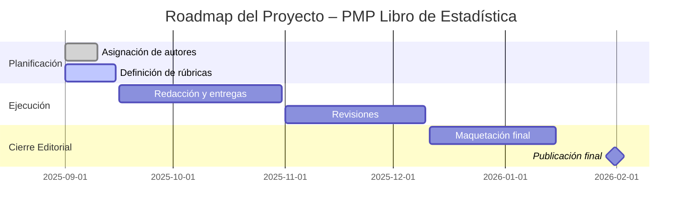

# 📖 Índice Maestro – PMP Libro de Estadística

## 📑 Documentos principales
- [Ficha Técnica](./Ficha_Tecnica.md)
- [Cronograma](./Cronograma.md)
- [Calidad](./Calidad.md)
- [Roles](./Roles.md)
- [Plan de Comunicación de Riesgos](./Comunicacion_Riesgos.md)

## 🗺️ Roadmap (Mermaid)

